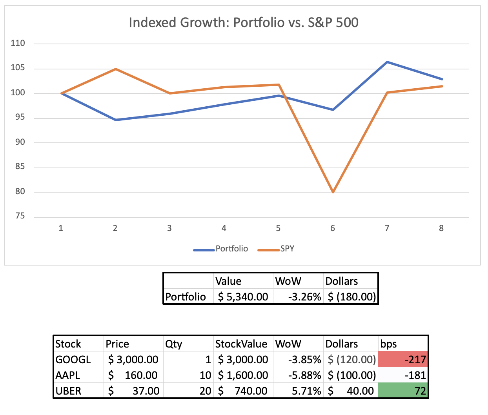

# Design: Stock Portfolio Script

## Goal
Create a script that:
1. Takes a .csv of my stock portfolio
2. Pulls historical price information 
3. Creates .pdf a Stock Performance Report

## Stock Performance Report
The report will have two sections, a weekly and monthly section, these follow the same format except that the weekly 
section will examine an 8 week period and the monthly section will examine a 6 month period.  For brevity I have only 
included the details about the weekly report.

### Mock up

### Datasets

#### Weekly Report

##### Flow A
1. Pull in portofolio ticker symbols and quantity owned of each stock
2. Get weekly stock close price of each stock

##### Flow B
1. Use the data from Flow A to obtain the 8 week performance of the total portfolio
2. Pull in the 8 week performance of the benchmark index (S&P 500)
3. Get week over week performance for the portfolio and for the benchmark
4. Index week 1 value of portfolio and benchmark to 100 and use the week over week performance to adjust the index 
values for each week

This dataset will be used to generate the line chart in report as well as the portfolio performance numbers.

##### Flow C
1. Use the output of flow A to create the week over week performance table
2. Use the portfolio data from flow B (week over week $ and % gain/loss) to generate the `bps` that each stock 
contributed to the gain/loss

This dataset will be used to generate the individual stock table in the report.

## Not included for MVP
* This reporting will be 'naive' meaning it will not take acquisition dates as an input

## Future Improvement Ideas
* Persist data in a database and have a two stage process:
  * ETL job that pulls the stock information and loads DB
  * Extract job that pulls information from DB and creates report
* Move this script to Raspberry pi so this can be run via CRON and e-mail the report to me